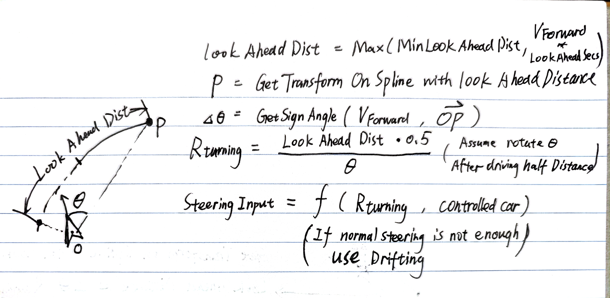
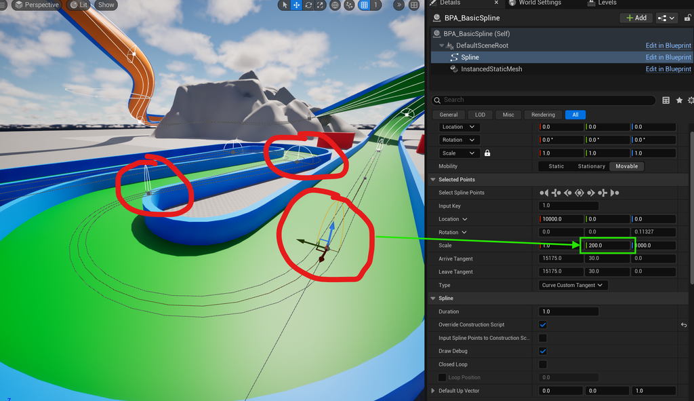
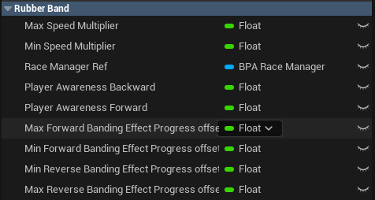
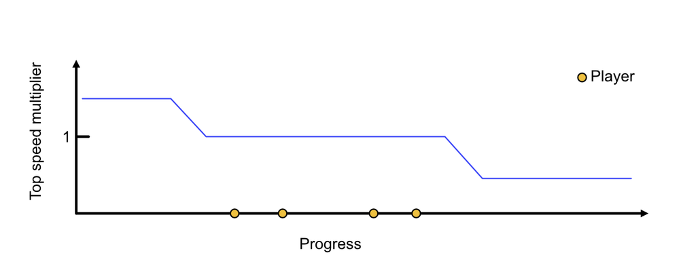
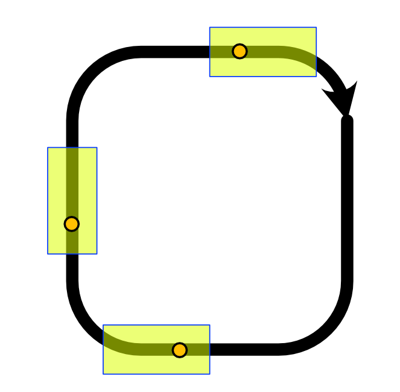

# 🤖 AI

## AI Showcases


4 AIs Racing Together



AI Racing with Debug Draw


## AI design

To bring dynamic and competitive racing experience, AI cars should act like players. Player Controller and AI controller are controlling the same pawn actor blueprint through the same interface.

### AI Manager

* control the **update frequency** (frequency to perceive the enviroment) of each AI controller to solve **performance issues**
* change the top speed multiplier of each AI controller according to the **rubber-band system**

### AI Controller

* Perception Layer
  * Query Spline Point Transformation at a certain distance ahead
  * Raycast to check obstacle in front of the AI car.
* Decision Layer
  * Calculate the throttle, steer, brake, drift according to the spline and the obstacle detection result
  * check if the car is stuck somewhere, then decide whether to reverse.
  * choose the fork in the road
  * use a item or honk.
  * choose random horizontal offset from road center
* Action Layer
  * Apply the input to the pawn

### AI Info Component

* Generate a capsule collider on the parent actor with special collision preset which will block AIPerception trace.
* AI controller will read the data from raycasted AI Info component.

## Important Technical Details

### AI Performance

After implementing AI controller logic, we have a severe performance issue. When AI controllers read transform of the spline point, it will get nearest point on the AI splines, which is the slowest part of the logic.\
To solve this problem, I create an AI manager to manually **tick the perception function on the one AI Controller per frame**. Although the AI is not following the latest point, AI can still drive well because of a good prediction of the route.

### AI Steering decision

Since I made the steering and drifting part of the car, I know the relation between rotation speed and turning radius.\
The following equations estimates the steering input for AI to apply on the pawn.

<figure><figcaption></figcaption></figure>

In practice, I also use the transform on spline with **half look ahead distance** to estimate the result better.

### AI Variety

<figure><figcaption></figcaption></figure>

Designer can set the width of the road for AI to move. The Y value of the scale decides the extent for AI to move around the AI spline. Each AI Controller has its own random seed.

### Rubber Banding System

#### **Reference**

[Game AI Pro - Rubber Banding System](http://www.gameaipro.com/GameAIPro/GameAIPro_Chapter42_A_Rubber-Banding_System_for_Gameplay_and_Race_Management.pdf)

> “Rubber-banding is a technique used in racing games to keep the AI drivers near to the\
> players in order to maintain the excitement in races. In simple terms, when an AI-controlled\
> vehicle gets too far in front of the player, it will slow down to allow the player to catch up\
> and, similarly, AI-controlled vehicles behind the player will gain a boost to their speed to\
> help them catch up to the player. In this way, the AI-controlled vehicles will appear to be\
> attached to the player via a rubber band, never getting too far from the player, hence the\
> term rubber-banding.”

**Terminologies**

* **Progress** indicates how far you have driven in the race.\
  For example, a progress value of **2.78** means:
  * **Current Lap:** 2
  * **Completion of Current Lap:** 78%
* **Forward-Banding:** When an AI Kart is leading, apply a negative effect to it.
* **Reverse-Banding:** When an AI Kart falls behind, apply a positive effect to it.

#### System Design

* Our rubber-banding is **Power-Based** (not Difficulty-Based)
  * It affects the **top speed** of AI-controlled Kart
  * **IMPORTANT**: If you make top speed **too high/low**, the kart may not fit the track design. e.g. There is a gap on the track. If the top speed is too low, it will not be able to cross the gap.
  * Power-Based: Change the “Engine Power”,
  * Difficulty-Based: Change the Skill Level of the AI driver. They can choose a better route, shortcut…
* The rubber-banding system is **disabled** for AI cars, when these cars are within the player's **awareness range.**
* Choose the player with **max progress** to be the reference progress for **forward banding**
* Choose the player with **min progress** to be the reference progress for **reverse banding**
* When applying forward banding effect to the leading AIs, Use Max AI progress to calculate the effect for all leading AIs.
* If the progress of AIs is between the First Player and the Last Player, not rubber banding.

<figure><figcaption></figcaption></figure>

| Max Speed Multiplier                       | 1.2   |
| ------------------------------------------ | ----- |
| Min Speed Multiplier                       | 0.8   |
| Player Awareness Backward                  | 0.01  |
| Player Awareness Forward                   | 0.03  |
| Max Forward Banding Effect Progress offset | 0.1   |
| Min Forward Banding Effect Progress offset | 0.05  |
| Min Reverse Banding Effect Progress offset | -0.05 |
| Max Reverse Banding Effect Progress offset | -0.1  |

<figure><figcaption></figcaption></figure>

<figure><figcaption>
Player Awareness Range
</figcaption></figure>

e.g. Player Progress is 2.15, then All the AIs with progress X.14\~X.18 do not have rubber-banding effect.

