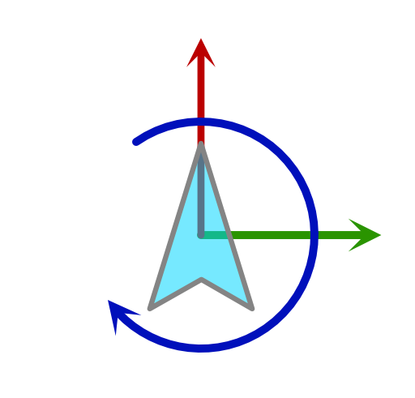
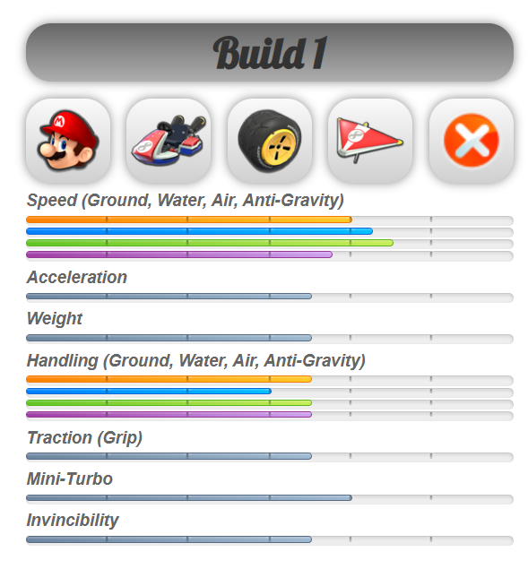
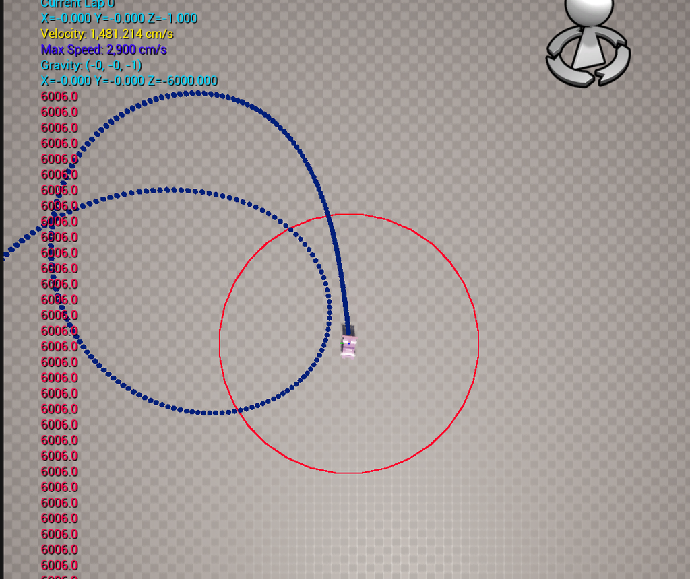
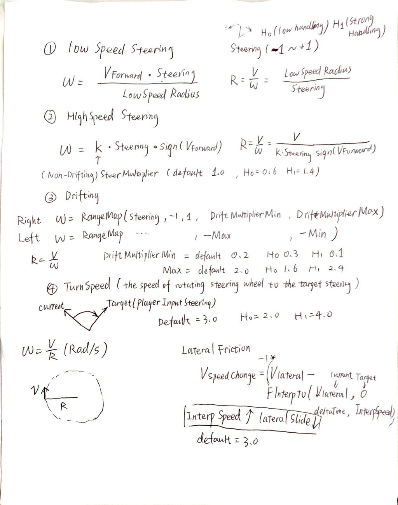

# 🚗 Car Physics

## Resources

* [Car Physics](https://www.asawicki.info/Mirror/Car%20Physics%20for%20Games/Car%20Physics%20for%20Games.html)
* [Mario Kart 8 Deluxe Statistics](https://www.mariowiki.com/Mario_Kart_8_Deluxe_in-game_statistics)
* [Supercharged! Vehicle Physics in Skylanders](https://www.youtube.com/watch?v=Db1AgGavL8E)

## Step 1: Build Physics Model

At the beginning the project, I search lots of articles for simulating car movement. I learnt a lot from [Car Physics](https://www.asawicki.info/Mirror/Car%20Physics%20for%20Games/Car%20Physics%20for%20Games.html):

* Straight Line physics (traction, drag, rolling resistance, braking)
* Turning at low speed (non-drifting)
* Turning at high speed (drifting)

## Step 2: Simplify the Model

The math and physics are really complicated. Since we are making an arcade racing game, we need to simplify the car physics and **make the player feel good to drive**. We also need to make the system **designer friendly**.\
And I find this GDC talk [Supercharged! Vehicle Physics in Skylanders](https://www.youtube.com/watch?v=Db1AgGavL8E), they have 4 pillars:

* **Simplify physics simulation when appropriate**
* **Parameters should be translated into designer language**
* **Complex behavior should come from layering simple systems**
* **Keep parameters independent**

We then decides to treat the car as a mass point. Besides gravity, we apply longitudinal and lateral force and rotate the car in yaw direction.

<figure><figcaption><p>Simplified Physics Model</p></figcaption></figure>

## Step3: Expose Attributes to Designers

When it comes to racing games, the first game that comes to mind is Mario Kart 8. I find some statistics for Mario Kart 8. [Mario Kart 8 Deluxe Statistics](https://www.mariowiki.com/Mario_Kart_8_Deluxe_in-game_statistics) In Mario Kart, there are 5 explicit attributes: Speed, Acceleration, Weight, Handling, and Traction.\
In our racing game, our game designer decides to use 3 main attributes: **Acceleration**, **Weight**, and **Handling**.

<figure><figcaption><p>Mario Kart Builds</p></figcaption></figure>

In the PoCT (Proof of Concept Technology), we divide and conquer the Physics of the car.

* longitudinal force (engine force and brake force)
* lateral force (lateral friction)
* z-rotation (steering and drifting)
* gravity

I am responsible for **lateral friction, steering and drifting.**

### Lateral Friction

Simply FInterp the lateral speed to zero for each tick.

### Steering and Drifting

I first try to use the function in real world to calculate the rotation speed (not drifting):$$\omega = v_{forward} * \tan(\delta) / L$$\
Delta is the steering angle, L is the wheel base. If the velocity is zero, the car will not rotate.

<figure><figcaption></figcaption></figure>

However, when you drive this car in the game. It does not feel good, because the rotation radius is only related with the steering angle for fixed wheelbase.\
After playtesting other arcade racing games, it feels like the turning radius is related with the forward speed. The higher speed will cause harder steering.\
For drifting, it will let the player to rotate faster than normal steering. Drift boost is done in the later milestone.


## Documentation

### **For Designer**

* H0 - when handling is 0.
* H1 - when handling is 1.

Tips for adjusting these parameters:

* About the following steer/drift multipliers, generally **the higher multiplier means smaller turning radius** (turn sharper)
* For drifting multiplier, why higher handling has smaller `drift multiplier min` ? Higher handling means wider range of controlling your turning. (you can do sharper turning and do gentler turning)
* `TurnSpeed` determines how quickly the car's steering wheel rotates to reach the target angle.

```
Programmer suggestion value:
SteerMultiplier default = 1.0 H0 = 0.6 H1 = 1.4
DriftMultiplierMin default = 0.2 H0 = 0.3 H1 = 0.1
DriftMultiplierMax default = 2.0 H0 = 1.6 H1 = 2.4
TurnSpeed default = 3.0 H0 = 2.0 h1 = 4.0
```

<figure><figcaption></figcaption></figure>

### Debug Draw

Toggle on `Is Debug Draw On` in Actor Component `BPC_KartSteering` , you can see the turning radius and trajectory in the world.

<figure><figcaption></figcaption></figure>

### For Programmer

<figure><figcaption></figcaption></figure>

