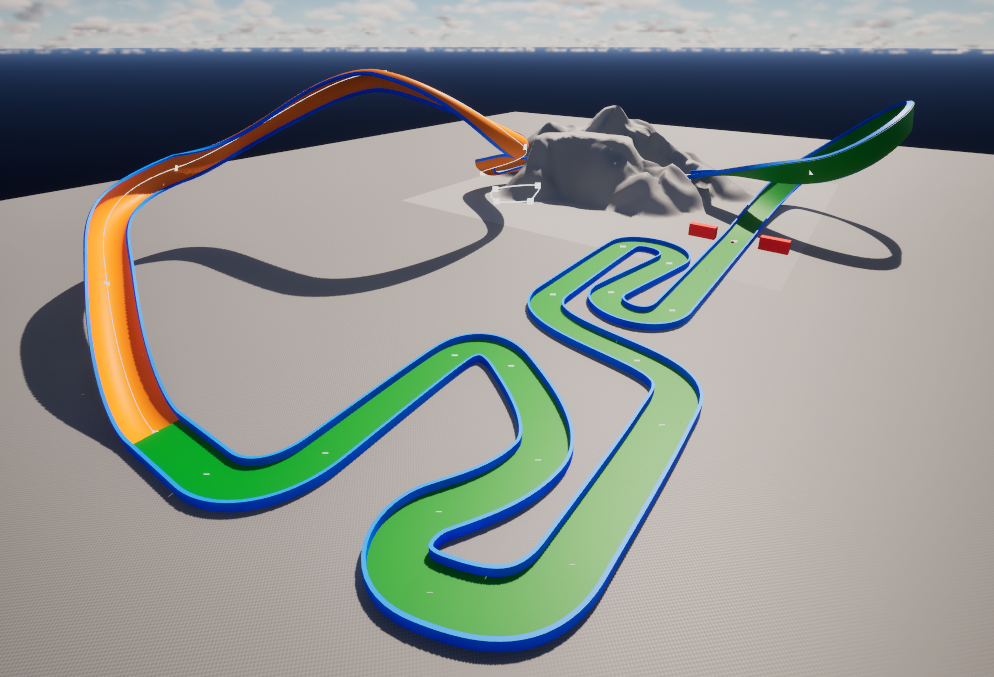
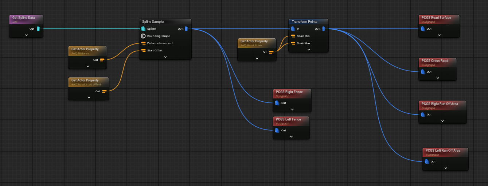
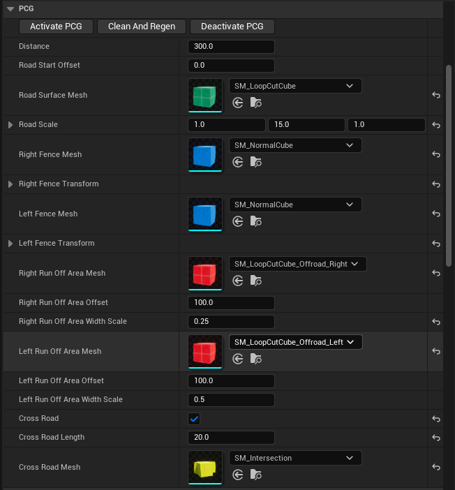
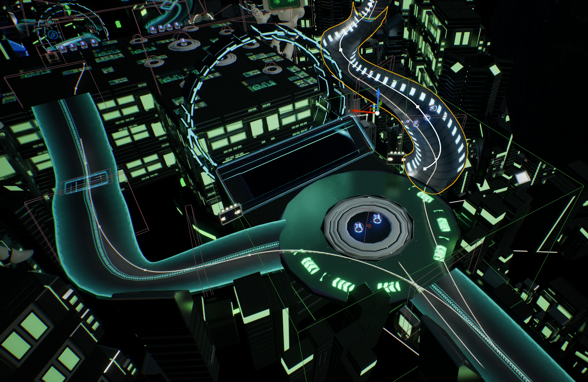
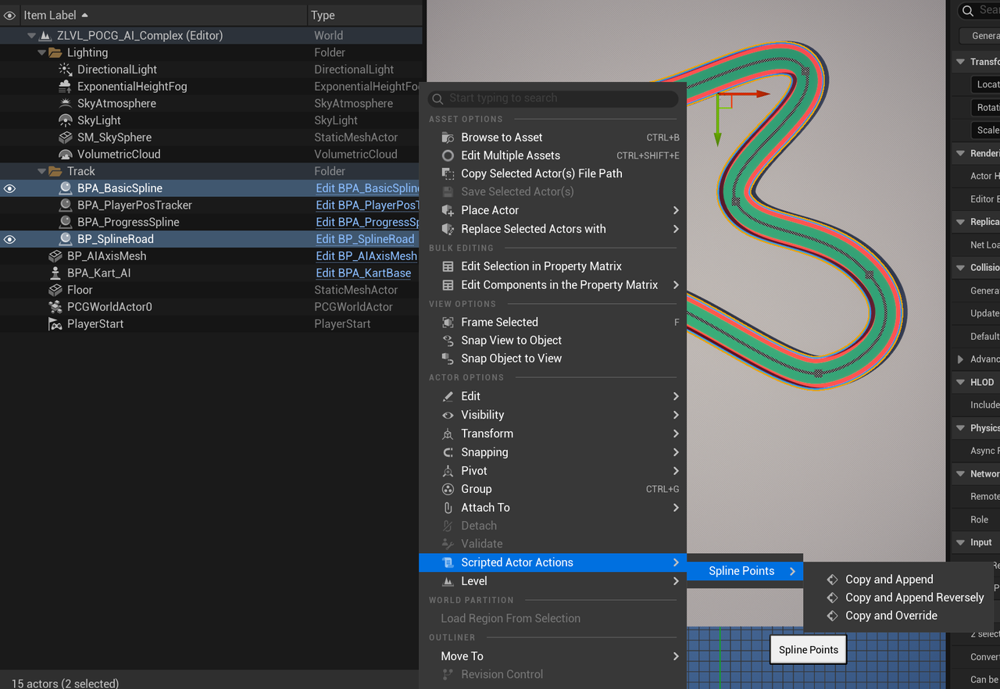

# 🛣️ PCG Road

<figure><figcaption>
PCG Sample Level
</figcaption></figure>

<figure><figcaption>
PCG Blueprint
</figcaption></figure>

<figure><figcaption>
PCG settings for designer
</figcaption></figure>

<figure><figcaption>
PCG roads in final game
</figcaption></figure>

<figure><figcaption>
Spline Editor Tools
</figcaption></figure>

I also use Unreal Editor Utility to help designers and programmers copy or append spline data easily.
