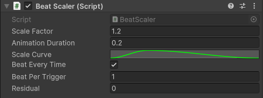
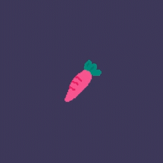
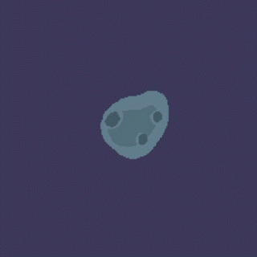
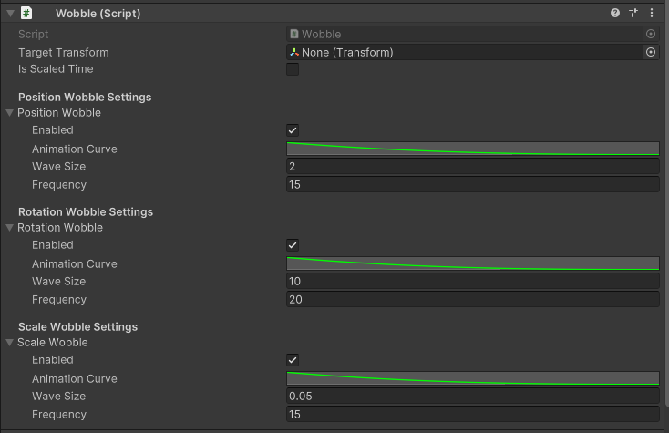
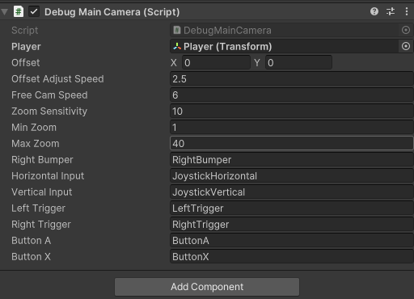

# 📜 Technical Details


The game has many technical details, and I won't cover them all here. Instead, I've selected a few of the most critical and creative features to highlight.


## Non-linear Transformation

One of the most interesting thing I learn in Team Game Production I (TGPI) was non-linear transformatoin. By applying non-linear functions followed by linear interpolation, I make the game much "**juicer**". The functions are easy to implement, but they can make interaction or visual more engaging and dynamic.

**Resource:**

* [Juice it or lose it - a talk by Martin Jonasson & Petri Purho](https://www.youtube.com/watch?v=Fy0aCDmgnxg)
* [Math for Game Programmers: Fast and Funky 1D Nonlinear Transformations](https://www.youtube.com/watch?v=mr5xkf6zSzk)&#x20;
* [Math for Game Programmers: Juicing Your Cameras With Math](https://www.youtube.com/watch?v=tu-Qe66AvtY)
* [How to make a Better Health Bar in Unity : Chip Away Tutorial](https://www.youtube.com/watch?v=CFASjEuhyf4)
* [I created the PERFECT grappling hook... and you can too! UNITY 2D](https://www.youtube.com/watch?v=dnNCVcVS6uw)
* [Easing Functions](https://easings.net/)

### Applications

#### Fraction-based transformations

Transform from state A to state B. Change position/rotation/scale/transparency/color...

```cpp
// Example
...
t = EasingFunction(t); // t is [0, 1]
float value = Interpolate(startValue, endVlue, t);
...
```

1. **BeatScaler.cs**

* Listens to the `BeatEvent` from an `AudioManager` instance to trigger scaling animations in sync with the music.
* Customizable Scaling Parameters for designers:
  * Scale Factor: Adjusts how much the GameObject scales up during the beat
  * Scale Curve: Utilizes `AnimationCurve` to precisely control the scaling over time, easy for designer/artist to have a complex and natural animations
  * Beat per trigger and Residual: Allows trigger scaling on certain beat (e.g. pulse on `3*n+1` beat)

<figure><figcaption></figcaption></figure>

<figure><figcaption></figcaption></figure>


<details>

<summary>BeatScaler.cs</summary>


```cs
...
void OnBeat()
{
	beatCounter++;
	if (!beatEveryTime)
	{
		if (((beatCounter - 1) % beatPerTrigger) != residual)
		{
			return;
		}
	}

	if (scalingCoroutine != null)
	{
		StopCoroutine(scalingCoroutine);
	}

	scalingCoroutine = StartCoroutine(ScalePulse());
}

IEnumerator ScalePulse()
{
	float elapsedTime = 0f;

	Vector3 targetScale = originalScale * scaleFactor;

	while (elapsedTime < animationDuration)
	{
		float t = elapsedTime / animationDuration;

		float scaleValue = scaleCurve.Evaluate(t);

		transform.localScale = Vector3.Lerp(originalScale, targetScale, scaleValue);

		elapsedTime += Time.unscaledDeltaTime;

		yield return null;
	}

	transform.localScale = originalScale;

	scalingCoroutine = null;
}
...
```



</details>

2. **Meteors.cs**

* Uses easing out function `1 - (1-t)^4` to change the scale of meteors.
* When players select/deselect a meteor, the meteor will enlarge/shrink.

<figure><figcaption></figcaption></figure>


<details>

<summary>Meteor.cs</summary>

```csharp
    private IEnumerator ScaleOverTime(float targetScale, float duration)
    {
        if (m_visual == null)
        {
            yield break;
        }

        Vector3 initialScale = m_visual.localScale;
        Vector3 finalScale = Vector3.one * targetScale;
        float timer = 0f;

        while (timer < duration)
        {
            float t = (timer / duration);
            t = 1 - (1 - t) * (1 - t) * (1 - t) * (1 - t);
            m_visual.localScale = Vector3.Lerp(initialScale, finalScale, t);
            timer += Time.unscaledDeltaTime;
            yield return null;
        }

        m_visual.localScale = finalScale;
    }
```


</details>

#### Deviation-based transformations

Camera shake (amplitude decays)

1. **Wobble.cs**

* Customizable wobble settings
  * Use animation curves to define the intensity of the wobble over time for position, rotation, and scale
  * Adjustable amplitude and frequency for the wobble
  * The shake is based on Perlin Noise, which can generate smooth and time-scalable shake.

<figure><figcaption></figcaption></figure>

<figure><figcaption></figcaption></figure>


<details>

<summary>Wobble.cs</summary>

```csharp
using System.Collections;
using System.Collections.Generic;
using UnityEngine;


public class Wobble : MonoBehaviour
{
    [Tooltip("You can set target in here, or left empty will wobble itself")]
    public Transform targetTransform;

    public bool isScaledTime = true;

    [System.Serializable]
    public class WobbleSettings
    {
        public bool Enabled = true;

        [Tooltip("An animation curve between 0 and 1 (for both x and y axis), usually 1 at the beginning of time and gradually falling back to 0.")]
        public AnimationCurve animationCurve = AnimationCurve.EaseInOut(0, 1, 1, 0);

        [Tooltip("Wobble Amplitude")]
        public float waveSize = 1f;

        [Tooltip("Wobble Frequency")]
        public float frequency = 1f;

        // The internal offset value is used to ensure the non-correlation of different coaxial directions
        [HideInInspector]
        public float offsetX;
        [HideInInspector]
        public float offsetY;
    }

    [Header("Position Wobble Settings")]
    public WobbleSettings positionWobble = new WobbleSettings();

    [Header("Rotation Wobble Settings")]
    public WobbleSettings rotationWobble = new WobbleSettings();

    [Header("Scale Wobble Settings")]
    public WobbleSettings scaleWobble = new WobbleSettings();

    // The original Transform property, used to recover after wobble
    private Vector3 originalPosition;
    private Quaternion originalRotation;
    private Vector3 originalScale;

    private Coroutine currentWobbleCoroutine = null;

    void Awake()
    {
        if (targetTransform == null)
        {
            targetTransform = this.transform;
        }

        InitializeOffsets();
    }


    private void InitializeOffsets()
    {
        positionWobble.offsetX = Random.Range(0f, 1000f);
        positionWobble.offsetY = Random.Range(0f, 1000f);

        rotationWobble.offsetX = Random.Range(0f, 1000f);
        rotationWobble.offsetY = Random.Range(0f, 1000f);

        scaleWobble.offsetX = Random.Range(0f, 1000f);
        scaleWobble.offsetY = Random.Range(0f, 1000f);
    }


    public void TriggerWobble(float duration)
    {
        if (currentWobbleCoroutine != null)
        {
            StopCoroutine(currentWobbleCoroutine);
            RestoreOriginalTransform();
            currentWobbleCoroutine = null;
        }

        SaveOriginalTransform();

        currentWobbleCoroutine = StartCoroutine(WobbleCoroutine(duration));
    }

    private void SaveOriginalTransform()
    {
        originalPosition = targetTransform.localPosition;
        originalRotation = targetTransform.localRotation;
        originalScale = targetTransform.localScale;
    }

    private void RestoreOriginalTransform()
    {
        targetTransform.localPosition = originalPosition;
        targetTransform.localRotation = originalRotation;
        targetTransform.localScale = originalScale;
    }

    private IEnumerator WobbleCoroutine(float duration)
    {
        float timePassed = 0f;

        while (timePassed <= duration)
        {
            if (isScaledTime)
            {
                timePassed += Time.deltaTime;
            }
            else
            {
                timePassed += Time.unscaledDeltaTime;
            }
            float percent = Mathf.Clamp01(timePassed / duration);
            float curveValue = 0f;

            // Calculate Position Wobble
            Vector3 newPosition = originalPosition;
            if (positionWobble.Enabled)
            {
                curveValue = positionWobble.animationCurve.Evaluate(percent);
                float noiseInputX = timePassed * positionWobble.frequency + positionWobble.offsetX;
                float noiseInputY = timePassed * positionWobble.frequency + positionWobble.offsetY;

                float noiseValueX = Mathf.PerlinNoise(noiseInputX, positionWobble.offsetX);
                float noiseValueY = Mathf.PerlinNoise(noiseInputY, positionWobble.offsetY + 100f);

                noiseValueX = Mathf.Lerp(-1f, 1f, noiseValueX);
                noiseValueY = Mathf.Lerp(-1f, 1f, noiseValueY);

                newPosition.x += curveValue * positionWobble.waveSize * noiseValueX;
                newPosition.y += curveValue * positionWobble.waveSize * noiseValueY;
            }

            // Calculate Rotation Wobble
            Quaternion newRotation = originalRotation;
            if (rotationWobble.Enabled)
            {
                curveValue = rotationWobble.animationCurve.Evaluate(percent);
                float noiseInputZ = timePassed * rotationWobble.frequency + rotationWobble.offsetX;

                float noiseValueZ = Mathf.PerlinNoise(noiseInputZ, rotationWobble.offsetY + 200f);

                noiseValueZ = Mathf.Lerp(-1f, 1f, noiseValueZ);

                newRotation = originalRotation * Quaternion.Euler(0f, 0f, curveValue * rotationWobble.waveSize * noiseValueZ);
            }

            // Calculate Scale Wobble
            Vector3 newScale = originalScale;
            if (scaleWobble.Enabled)
            {
                curveValue = scaleWobble.animationCurve.Evaluate(percent);
                float noiseInputScale = timePassed * scaleWobble.frequency + scaleWobble.offsetX;

                float noiseValueScale = Mathf.PerlinNoise(noiseInputScale, scaleWobble.offsetY + 300f);

                noiseValueScale = Mathf.Lerp(-1f, 1f, noiseValueScale);

                float scaleOffset = curveValue * scaleWobble.waveSize * noiseValueScale;
                newScale += new Vector3(scaleOffset, scaleOffset, scaleOffset);
            }

            targetTransform.localPosition = newPosition;
            targetTransform.localRotation = newRotation;
            targetTransform.localScale = newScale;

            yield return null;
        }

        RestoreOriginalTransform();

        currentWobbleCoroutine = null;
    }
}
```


</details>

## Character Mechanics

The following parts are very detailed and very specific to this project, so I will only use several key ideas to summarize.

### Movement

* Designed for uniform motion, continuously adjusting the player's velocity with forces to match the desired speed.

### Input

* Although our game is played on tablet, I still make both mouse input and touch input to improve the development speed.
* Gesture:
  * Tap: lasso on the meteor, or release the lasso
  * Press: slow down time
  * Touch with 2 finger: cancel action
  * Drag: pan the camera
  * Pinch: Zoom the camera

### Lasso

<figure><figcaption></figcaption></figure>

* When the player throws a lasso on a meteor, if the rope continues to shorten, the player will continue to move in a straight line until the rope is about to start extending. Once tight, the player transitions to circular motion using a `Distance Joint 2D`.
* Upon releasing the lasso in the zero-gravity environment, the player retains their velocity and continues moving linearly.

### Animation

* Animations are triggered or chosen by the character’s lasso status, horizontal movement speed, and events such as taking damage, collecting items, and entering black holes.

#### Visual

* Trajectory Line: Displays a trajectory line after the player holds the screen for over 0.5 seconds to indicate the movement direction.
* Particle Trail: Uses different trail colors to represent the player's speed levels. Particles are generated at their spawn points and gradually shrink until they vanish.
* various other juicy visual enhancements to improve the game's "juice".

## Debug Camera System

**Resources:**

* [Trailer Made: What Makes a Successful and Memorable Game Trailer](https://www.youtube.com/watch?v=QWd7F0z1W_Y)&#x20;
* [GDC 2018 - Capturing Great Footage For Game Trailers](https://www.youtube.com/watch?v=XpMBxfqc67A)

**Purpose:**

* To create a game trailer, implementing a debug camera with cinematic controls such as panning, zooming, and following is necessary.
* Additionally, UI toggling makes footage visually focused.
* Using a game controller to manipulate the camera provides intuitive and responsive control.

**Features:**

* There are 2 mode: Follow Player mode and Free Camera mode. Use **Xbox Right Bumper** to switch mode
* Use **Left Joystick** to change the offset (Follow Player mode) or the world position of the Camera (Free cam mode)
* **Xbox Left Trigger** to Zoom Out
* **Xbox Right Trigger** to Zoom In
* **Xbox Button A** to toggle on/off the UI gameplay and pause button
* **Xbox Button X** to double the camera move speed
* **Xbox Button Y** to reset the camera

<figure><figcaption></figcaption></figure>

<figure><figcaption></figcaption></figure>
